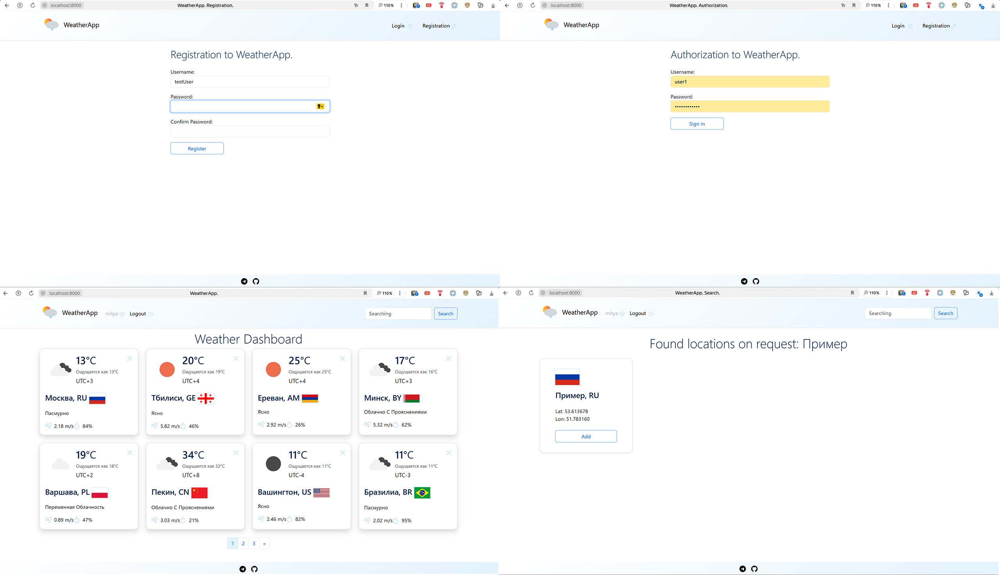
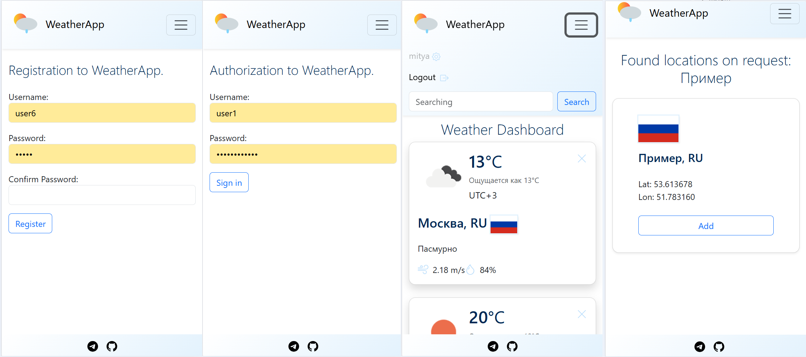

# Проект “Погода”

---

## Ссылка с информацией
https://zhukovsd.github.io/python-backend-learning-course/projects/weather-viewer/

### Описание
Веб-приложение для просмотра текущей погоды. Пользователь может зарегистрироваться и добавить в коллекцию одну или несколько локаций (городов, сёл, других пунктов), после чего главная страница приложения начинает отображать список локаций с их текущей погодой.

### Мотивация проекта
- Реализация многопользовательского приложения
- Работа с внешними API

### Запуск приложения
1. Дописать. 

### Структура проекта

### Функционал приложения
- Регистрация/Авторизация/Logout
- Поиск локаций по названию
- Добавление локация на главную страницу
- Удаление локаций

### Используемые технологии:
- Python
- Django
- Poetry
- Postgres
- DjangoORM
- Миграции
- HTML/CSS, Bootstrap
- SQLAlchemy, alembic
- Тесты
- Docker / Docker Compose

### Автор
Дмитрий Валюженич
Mitya0777@gmail.com
